<div align="center">

# AI 面试指南

**多视角 AI 面试官平台** —— 简历解析评分 · 多视角模拟面试 · 知识库 RAG 问答，Web 与微信小程序双端

**[ 在线体验 ](https://openagent.media)** · Web 端已上线，微信小程序搜索「**面试助手agent**」即可使用

[](https://openagent.media)
[](https://openjdk.org/)
[](https://spring.io/projects/spring-boot)
[](https://spring.io/projects/spring-ai)
[](https://react.dev/)
[](https://uniapp.dcloud.net.cn/)
[](https://www.postgresql.org/)
[](./LICENSE)

</div>

---

## 项目介绍

AI 面试指南是一个面向求职准备场景的智能面试平台，围绕「练前诊断 — 模拟实战 — 复盘提升」的完整闭环，提供**简历智能解析评分**、**多视角模拟面试**、**知识库 RAG 问答**、**题库管理**与**运营管理后台**五大能力，并已同时交付 Web 端与微信小程序端。

平台的核心差异化能力是**多 Agent 协同的面试官工作流**：部门经理 / 技术面试官 / HR 面试官三类视角均为独立配置的 Agent——各自持有出题与评分 Prompt、考察职责和权重，且支持在管理后台页面化创建与调整；Spring AI Alibaba Graph 状态机作为编排器，按权重调度各 Agent 轮番出题、基于回答质量实时追问、逐题独立评分，最终由汇总节点将多视角结果汇聚为一份带加权总分、能力画像与改进建议的综合评估报告。全过程通过 SSE 实时推送，Web 端与小程序端共享同一套后端与工作流。

在工程层面，平台完成了多项面向生产环境的设计：AI 模型凭证与角色槽位解耦、运行时热切换无需重启；向量与全文混合检索保障 RAG 召回质量；Graph 工作流基于 PostgreSQL CheckPoint 支持中断恢复；全链路接入 Prometheus + Grafana 指标监控与可视化。

## 工程设计亮点

- **模型热切换注册中心**：`AiModelRegistry` 以 `DelegatingChatModel`（volatile 委托单例）承载主 / 小双模型槽位，后台指派在事务提交后（`afterCommit`）重建 ChatModel 并热替换引用——全局 10+ ChatClient 注入点零改动、瞬间生效，飞行中的请求用旧实例跑完；`alignPromptOptions` 修正了 Spring AI 调用链 Prompt options 缓存导致的「URL 切了但模型名没切」问题。小模型槽位为空时自动退化指向主模型。
- **人机协同的工作流中断模型**：Graph 编译期 `interruptAfter(question_generator)` 让状态机在出题后挂起等待人类作答，答案经 `updateState(答案, nextNode)` 从断点续跑而非重头执行；`WorkflowRecoveryRunner` 启动时扫描 PROCESSING 会话逐个恢复（含「checkpoint 缺少 CURRENT_ANSWER」的 gap 一致性防御——崩溃发生在答案写入前则降级为待作答），服务任意时刻重启面试不丢进度。多实例部署下以**执行权租约 + 看门狗心跳**（`workflow_owner` + `workflow_lease_until`，进入 PROCESSING 持有、回到等待/结束释放）保障恢复安全：后台看门狗线程每 30s 为本实例全部活跃会话续租（租期仅 90s、容忍 3 个心跳周期）——存活实例的长流程（慢 LLM / 重试叠加）永不被误判死亡，实例真崩溃后 90s 内即可被安全接管；恢复器只扫描无主或租约过期的会话，恢复前再原子抢占一次，租约所有权只能被持有者或到期后的抢占者改变。
- **多视角 Agent 全量配置化与降本评估**：面试官角色（出题 Prompt / 评分 Prompt / 权重）全部为数据库行，运营后台页面化调整、支持会话级权重覆盖；权重同时驱动 LLM 出题调度与最终加权评分。终评采用**每视角单次批量评估**（复用逐题已产出的得分与反馈），LLM 调用次数从题数降为视角数，并配 AI 失败 → 逐题均分 → 纯 DB 三级降级链保证报告必达。
- **双链路简历解析（多模态）**：Tika 文本解析 + 视觉大模型识图按「文本有效性（< 100 字符判定扫描件）+ 后台可配视觉优先策略」动态路由；视觉候选沿 CHAT → SMALL_CHAT 槽位按序退化，全部失败回退文本。PDF 逐页 150 DPI 单请求识别（15 页上限控制成本），识图同请求产出简历文本 + 排版评价双字段 JSON——文本回写缓存避免重复识图，排版评价仅注入当次评分参考。
- **三路混合检索 + 两级排序**：pgvector（HNSW）向量 + ParadeDB pg_search（BM25）+ MCP Web 搜索三路并行（Web 路 10s 超时降级为空不阻塞），RRF(k=60) 粗排 + 小模型 LLM 精排（候选 ≤ 5 短路跳过精排省一次调用，漏打分候选回退 RRF 基准分）；启动期自动 `CREATE EXTENSION pg_search` 并建 BM25 索引，扩展缺失时检索优雅降级纯向量。
- **自研中英混合语义分块**：Parent-Child 双粒度（1200 / 300 token），相邻父块双向 150 token overlap 防语义断裂；中文 2 字符 / 非中文 4 字符的轻量 token 估算不依赖 tokenizer 库；仅子块向量化、命中后回链父段落完整上下文。
- **异步任务可靠性**：Redis Stream 消费者组模板（阻塞读、批拉、MAXLEN 裁剪、失败重投 3 次）；`CAS 状态抢占`（AWAITING→PROCESSING 悲观行锁）+ 出题 / 评分 / 入队三处节点级幂等守卫，杜绝双击与重启重放导致的重复执行；曾定位并修复两类真实并发缺陷——事务内发消息导致消费者脏读（改 afterCommit 投递）、findById+save 旧快照回写覆盖并发更新（改定向 `UPDATE` 语句）。
- **LLM 调用统一防线**：`StructuredOutputInvoker` 收敛结构化输出（可配重试、失败原因回注、函数式校验器、多模态 Media 重载）；`PromptSecurityConstants` 每次调用生成不可预测 UUID 边界标签包裹用户输入并剥离伪造闭合，一处接入覆盖全部 LLM 调用的提示注入防御。
- **分布式限流与出网安全**：`@RateLimit` 注解（GLOBAL / IP / USER 维度组合）+ Redis Lua 两阶段令牌桶（先全维度预检查再统一扣减，保证多维原子性），Hash Tag 适配 Redis Cluster，17 个接口接入、支持降级方法回退；LLM 出网请求经 SSRF 防护拦截器（解析目标全部 IP，拦截 RFC1918 私网 / 云元数据 169.254.169.254 / IPv6 ULA，回环放行兼容本地模型）。
- **多端与账号安全**：一套 SSE 协议三端适配（Web EventSource / 小程序 enableChunked 含跨 chunk UTF-8 半包处理 / SSE 不可用时 checkpoint 驱动的轮询降级），RAG 问答另备同步通道兼容小程序流式缺陷；微信登录绑定采用独立绑定表 + 双通道凭证（防账号枚举统一报错、openid 全程不出后端的 5 分钟一次性票据、错 5 次作废防爆破、双向冲突检查不静默迁移）。

## 系统架构

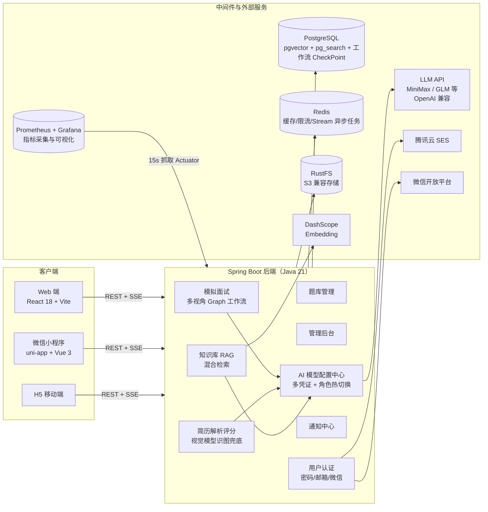

## 技术栈

### 后端

| 技术 | 版本 | 说明 |
| --- | --- | --- |
| Java | 21 | 开发语言 |
| Spring Boot | 4.0.1 | 应用框架 |
| Spring AI | 2.0.0-M1 | AI 集成，OpenAI 兼容协议接入任意厂商 |
| Spring AI Alibaba Graph | 2.0.0-M1.1 | 多视角面试官工作流编排（状态机 + CheckPoint） |
| PostgreSQL + ParadeDB | - | 主库 + pgvector 向量检索 + pg_search 全文检索 |
| Redis + Redisson | 7 / 4.7.0 | 缓存、限流、Stream 异步任务 |
| Spring Security + JJWT | - / 0.12.6 | 认证授权（JWT） |
| Apache Tika + POI | 2.9.2 / 5.2.5 | 简历与文档解析 |
| iText 8 | 8.0.5 | 面试/分析报告 PDF 导出 |
| 腾讯云 SES SDK | 3.1.1291 | 邮箱验证码与邮件通知 |
| AWS S3 SDK | 2.29.51 | S3 兼容对象存储（RustFS） |
| Spring AI MCP Client | - | Web 搜索工具（WebFlux） |
| Micrometer + Prometheus + Grafana | - | 指标监控与可视化（Actuator 独立端口，15s 抓取） |
| Gradle | 8.14 | 构建工具 |

> 注：Spring Boot 4.0 与 Spring AI 2.0.0-M1 为里程碑预览版，API 可能随正式版变动。

### Web 前端

| 技术 | 版本 | 说明 |
| --- | --- | --- |
| React | 18.3 | UI 框架 |
| React Router | 7 | 路由管理 |
| TypeScript | 5.6 | 开发语言 |
| Vite | 5.4 | 构建工具 |
| Tailwind CSS | 4.1 | 样式框架（CSS-first） |
| Recharts | 3.6 | 评分雷达图等图表 |
| Framer Motion | 12 | 动画 |
| react-markdown | - | Markdown 流式渲染 |
| react-virtuoso | - | 长列表虚拟滚动 |
| pnpm | 10.26 | 包管理器 |

### 小程序 / H5

| 技术 | 版本 | 说明 |
| --- | --- | --- |
| uni-app | 3.0 | 跨端框架，一套代码编译微信小程序 + H5 |
| Vue | 3.4 | UI 框架 |
| TypeScript | 5.4 | 开发语言 |
| Vite | 5.2 | 构建工具 |
| Pinia | 2.1 | 状态管理 |
| marked | - | Markdown 渲染 |
| SCSS | - | 样式预处理 |

## 功能特性

### 多 Agent 协同模拟面试（核心能力）

- **多 Agent 协同面试官**：部门经理 / 技术面试官 / HR 面试官为三个独立配置的 Agent（各自持有出题与评分 Prompt、考察职责与权重），由 Graph 状态机统一编排调度，按权重轮番提问，还原真实面试的多方考察结构。
- **Graph 工作流编排**：入场 → 决策（提问 / 切换视角 / 结束）→ 角色切换 → 检索准备 → 出题 → 评分 → 综合报告，全流程由 Spring AI Alibaba Graph 状态机驱动，PostgreSQL CheckPoint 支持中断恢复。
- **面试官 Agent 页面化配置**：视角不写死在代码里——管理后台提供面试官角色管理页，支持创建 / 编辑面试官 Agent 的出题 Prompt、评分 Prompt、默认权重与启用状态，配置即时应用于后续面试。
- **智能追问与难度递进**：基于回答质量实时追问，配合题目难度标签，由浅入深还原真实面试节奏。
- **SSE 实时对话**：面试过程流式推送，打字机式对话体验。
- **综合评估报告**：各视角独立评分 + 加权总分 + 综合评价 + 能力画像 + 优势与改进建议，支持导出 PDF。
- **灵活配置**：题量 6~15 可选，面试官视角与权重自由组合。

### 简历智能解析

- **多格式解析**：支持 PDF / DOCX / TXT，基于 Tika 与 POI。
- **视觉模型识图兜底**：扫描版、复杂排版 PDF 逐页渲染为图片，由多模态模型识别为结构化文本。
- **多维度 AI 评分**：总分 + 5 维度雷达图 + 核心评价 + 优势亮点 + 分级改进建议。
- **一键面试**：解析完成即可对该简历直接发起多视角模拟面试。

### 知识库 RAG 问答

- **文档智能处理**：文档上传、语义分块（Parent-Child 层级结构）、向量化（pgvector HNSW 索引），检索时以 Child 命中、回溯 Parent 上下文，兼顾精度与完整度。
- **两级混合检索 + 重排**：
  - **知识库内检索**：查询改写（可配置开关）→ 向量检索与 BM25 全文检索（pg_search）并行 → RRF 融合排序；
  - **面试出题检索**：题库全文、知识库向量、MCP 联网搜索三路并行召回 → 候选超过 5 条时由**小模型 Reranker** 对全部候选做相关性打分重排（未配置小模型或打分失败时自动退化 RRF 排序），取 TopK 注入出题上下文。
- **MCP 联网搜索**：基于 Spring AI MCP Client 接入 Web 搜索工具（工具名可配置，默认 `web_search`），任何兼容 MCP 协议的搜索服务均可接入，出题时自动补充最新的技术资料与行业信息，不绑定特定模型厂商。
- **流式问答**：SSE 打字机式响应，AI 思考过程可视化折叠展示。
- **会话管理**：历史会话、置顶、重命名。

### 题库管理

- 题库与题目 CRUD，支持 Excel / 文档批量导入。
- 全文检索、题目状态管理，可作为面试与学习的私有题库。

### 管理后台与模型治理

- **数据仪表盘**：用户、简历、面试、知识库总量统计与最近活动流。
- **用户管理**：注册审批、启用/禁用。
- **AI 模型配置中心**：多供应商凭证管理（任意 OpenAI 兼容 API），主模型 / 小模型（Reranker）角色槽位指派，**运行时热切换无需重启**，连通性探活，视觉能力标记与优先级。
- **面试官角色管理**：可视化配置面试官 Agent 角色——出题 Prompt、评分 Prompt、默认权重与启用状态，页面化创建 / 编辑，无需修改代码。
- **审计日志**：关键操作留痕。

### 多端一体化

- **Web 端**（React SPA）与**微信小程序 / H5 端**（uni-app）共用同一后端与账号体系。
- 小程序端同样支持 SSE 流式面试对话与 RAG 问答。

### 用户体系与安全

- 用户名密码 / 邮箱验证码（腾讯云 SES）/ 微信登录与账号绑定三种方式，JWT 认证。
- root 管理员账号随应用启动自动初始化，无需手工建号。

### 通知中心与会员体系（建设中）

- **通知中心**：站内信页面已上线；微信订阅消息推送仍在建设中。
- **会员积分**：基础框架（积分账户、每日签到、等级与额度）已就绪，积分商城与连续签到奖励等玩法持续开发中。

## 效果展示

以下截图均来自线上环境（[openagent.media](https://openagent.media)）。

### Web 端

工作台（简历上传 + 数据概览）：

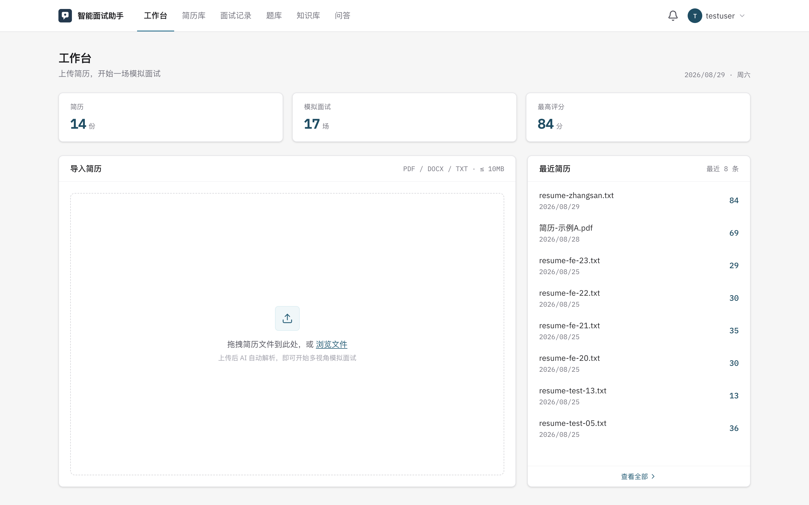

简历 AI 分析（多维度评分 + 雷达图）：

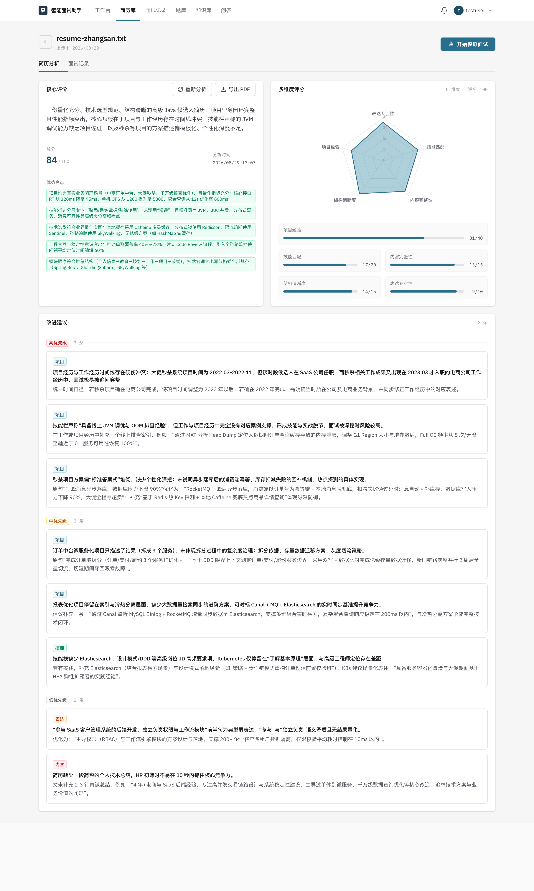

模拟面试配置（多视角面试官 + 权重）：

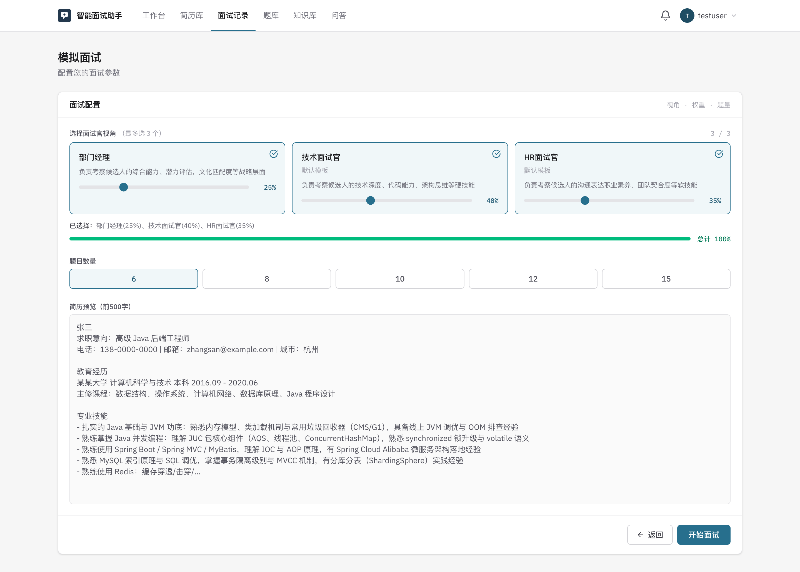

面试实时对话（SSE 流式 + 追问 + 难度标签）：

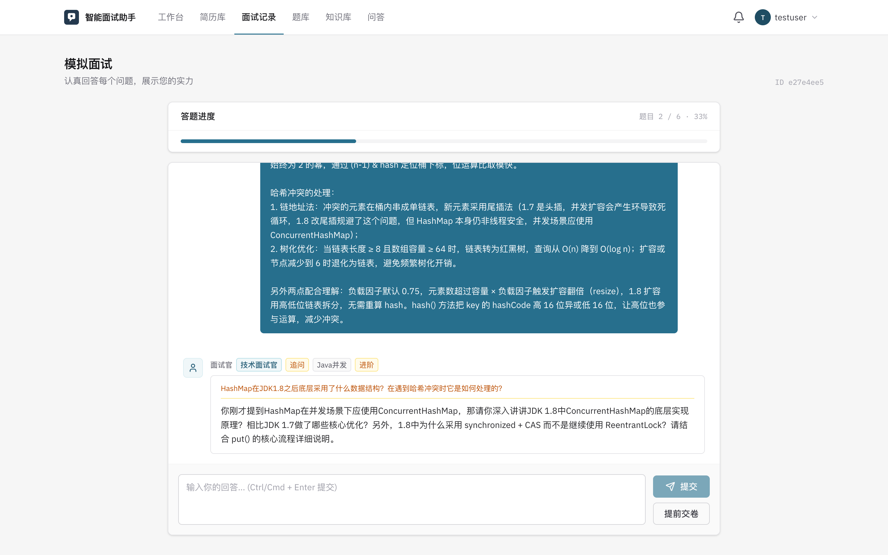

多视角面试综合报告：

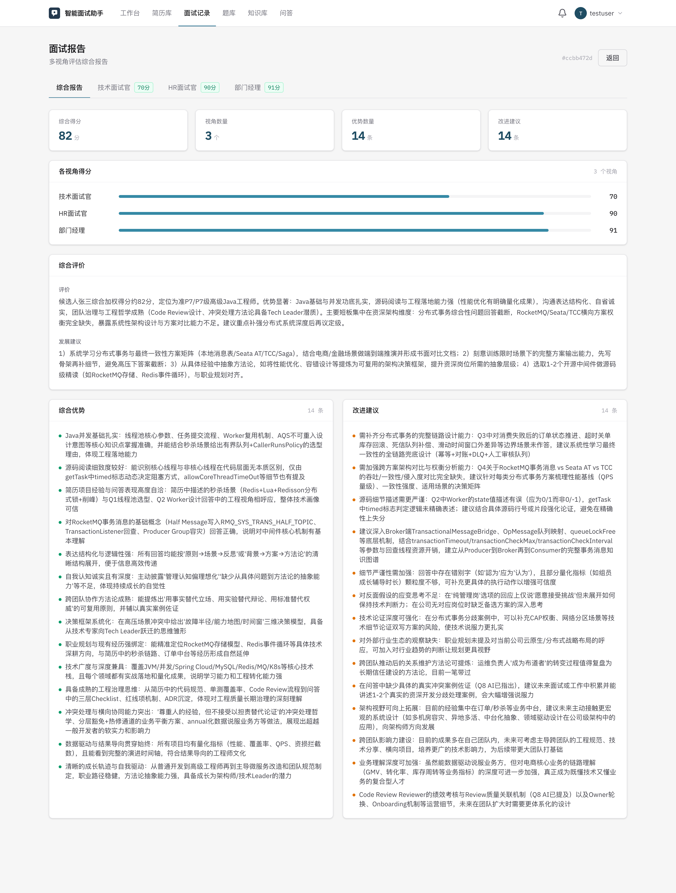

知识库 RAG 问答（SSE 流式 + 思考过程）：

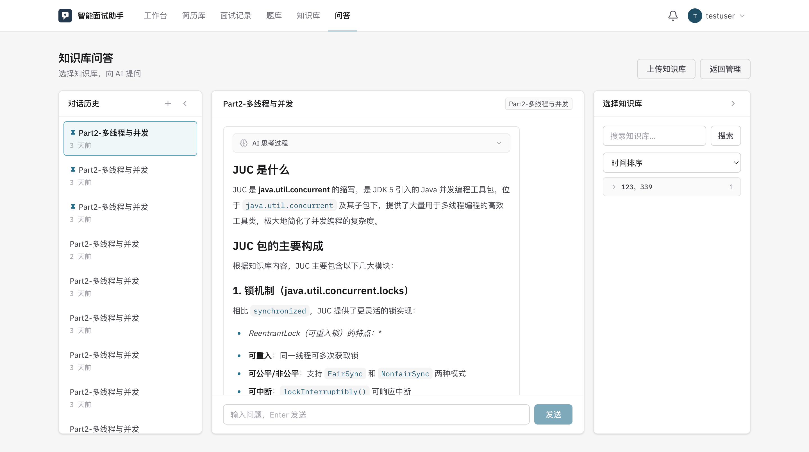

### 管理后台

数据仪表盘：

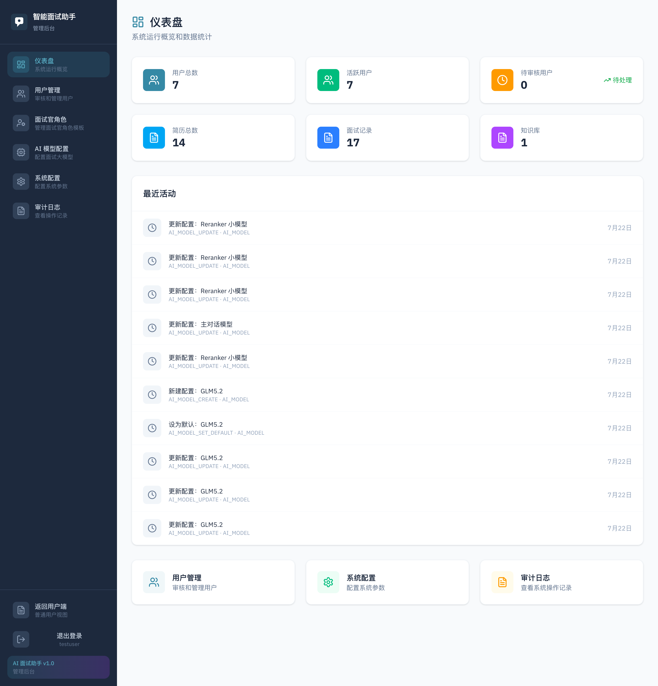

AI 模型配置中心（多凭证 + 角色槽位指派 + 热切换）：

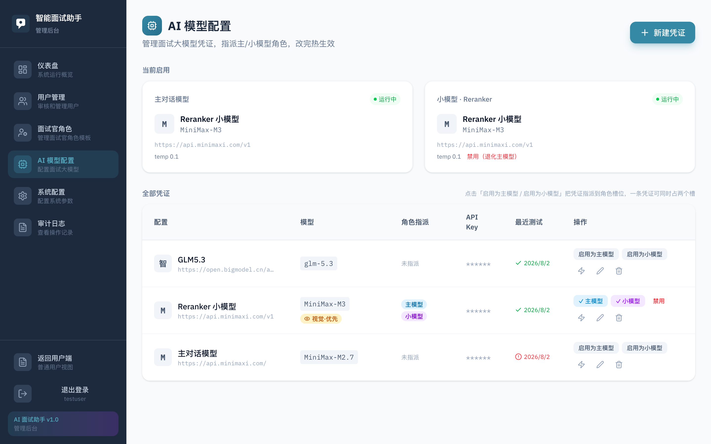

### 微信小程序「面试助手agent」

<table>
  <tr>
    <td align="center">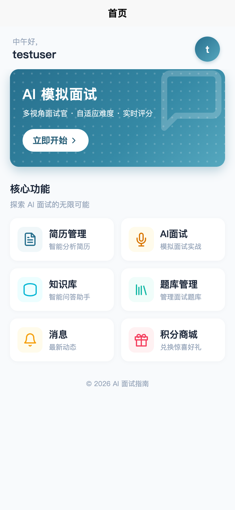<br/>首页</td>
    <td align="center">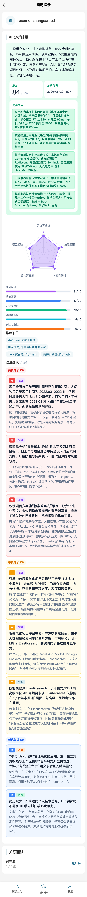<br/>简历分析</td>
    <td align="center">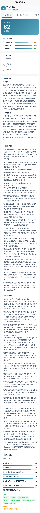<br/>面试报告</td>
    <td align="center">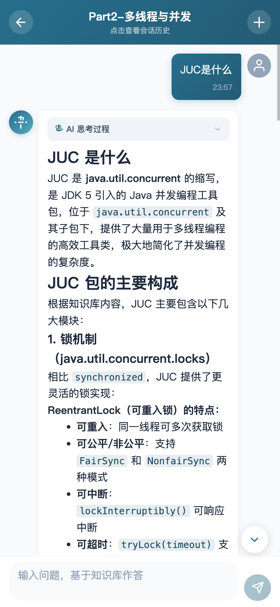<br/>知识库问答</td>
  </tr>
</table>

## 快速开始

环境要求：

| 依赖 | 版本 | 必需 | 说明 |
| --- | --- | --- | --- |
| JDK | 21 | 是 | 后端开发语言 |
| Node.js | 18+ | 是 | 前端构建 |
| pnpm | 10+ | 是 | Web 前端与小程序包管理器 |
| Docker | - | 推荐 | 一键启动中间件（PostgreSQL / Redis / RustFS） |

### 1. 克隆项目并配置环境变量

```bash
git clone <your-repo-url>
cd interview-guide

cp .env.example .env
# 编辑 .env，按需填写：
#   JWT_SECRET                —— 必填，认证签名密钥
#   POSTGRES_* / REDIS_*      —— 数据库与 Redis 连接（默认与 docker-compose 对齐）
#   APP_STORAGE_*             —— 对象存储（默认与 RustFS 容器对齐）
#   EMBEDDING_API_KEY         —— Embedding 模型（DashScope 兼容模式）
#   MINIMAX_API_KEY           —— 可选，LLM 凭证（正式配置见下方「AI 模型配置」）
#   SES_*                     —— 邮箱验证码功能（腾讯云 SES）
#   WECHAT_MINIAPP_*          —— 微信小程序登录
```

### 2. 启动中间件

```bash
docker compose up -d   # postgres / redis / rustfs / prometheus / grafana
```

### 3. 启动后端

```bash
./gradlew bootRun      # http://localhost:8080
```

应用启动时由 JPA 自动建表（无需手工执行 SQL），并**自动初始化 root 管理员账号**：

- 无 `username='root'` 的用户 → 插入（`id=0`，`role=ADMIN`，密码 BCrypt 存储）
- 已存在 → 跳过，不覆盖已修改的密码

| 字段 | 值 |
| --- | --- |
| 用户名 | root |
| 默认密码 | 123456（首次登录后请立即修改） |
| 角色 | ADMIN（管理后台入口） |

### 4. 启动 Web 前端

```bash
cd frontend
pnpm install
pnpm dev               # http://localhost:5173
```

### 5. 启动小程序 / H5

```bash
cd miniprogram
pnpm install

# 微信小程序：编译后用微信开发者工具导入 dist/dev/mp-weixin
pnpm dev:mp-weixin

# 或 H5 模式：浏览器直接访问 http://localhost:5174
pnpm dev:h5
```

### 6. 首次登录与 AI 模型配置

1. 用 `root` / `123456` 登录 Web 端（<http://localhost:5173>），**登录后立即修改密码**。
2. 进入管理后台 **→ AI 模型配置**（`/admin/ai-models`），新建一条 LLM 凭证（Base URL + API Key + 模型名，任意 OpenAI 兼容 API 均可），点「启用为主模型」——**立即热生效，无需重启**。
3. 可选：再指派一条「小模型 / Reranker」；不指派则自动退化使用主模型。

> 在指派主模型之前，普通用户触发面试 / 简历评分等 AI 功能会提示「AI 模型未配置，请联系管理员配置模型」——这是预期行为，配置后即恢复。

### 生产部署

项目根目录提供一键部署脚本（构建后端 jar / 前端产物并上传服务器，自动处理 Prometheus 配置等）：

```bash
./gradlew :app:bootJar --no-daemon -x test   # 本地构建后端
./deploy.sh                                  # 前置：.env 中填写 SERVER_HOST 等部署变量
```

## 许可证

[AGPL-3.0](./LICENSE) —— 本项目基于 AGPL-3.0 协议开源：只要通过网络提供服务，就必须向用户公开修改后的源码。
